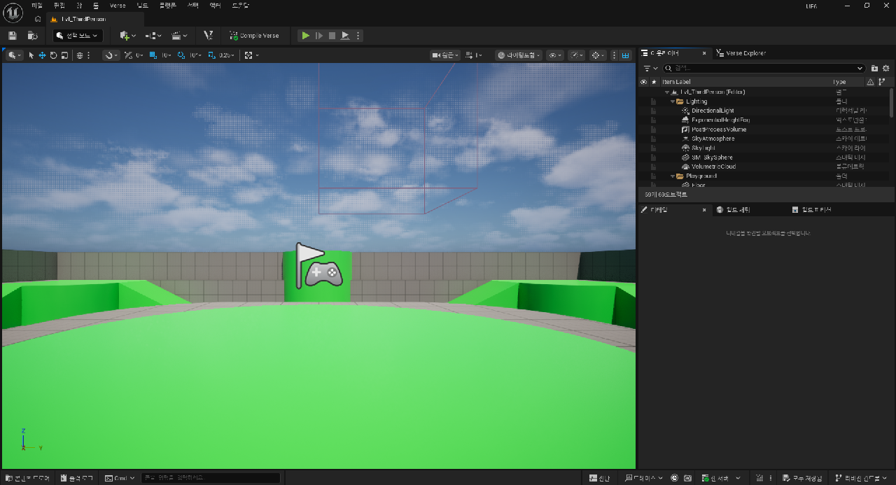
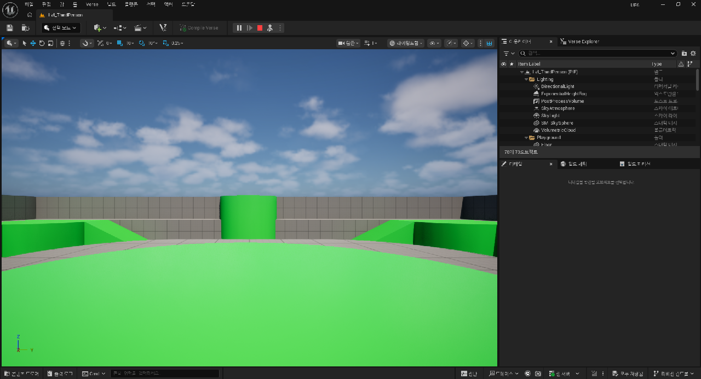
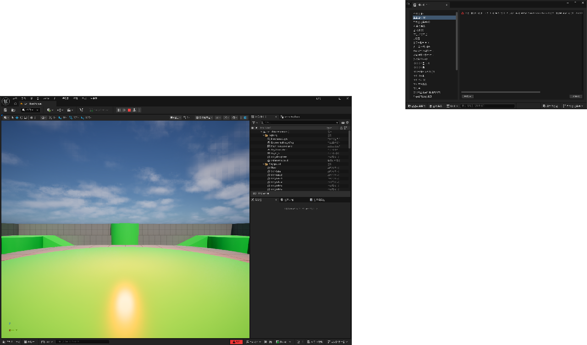
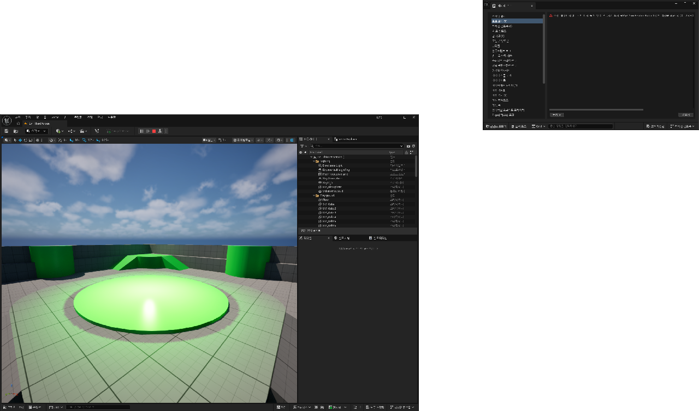
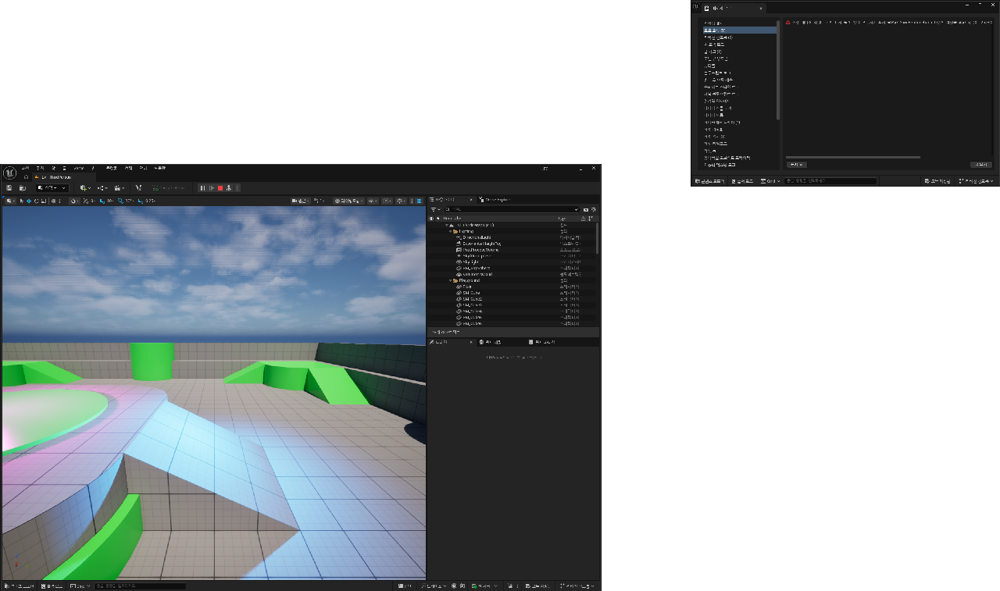
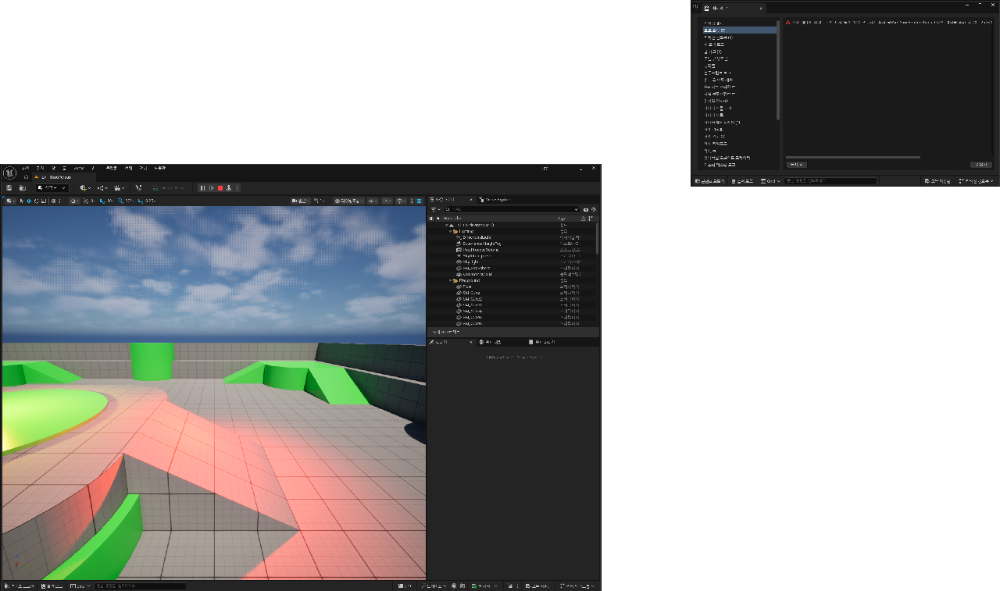
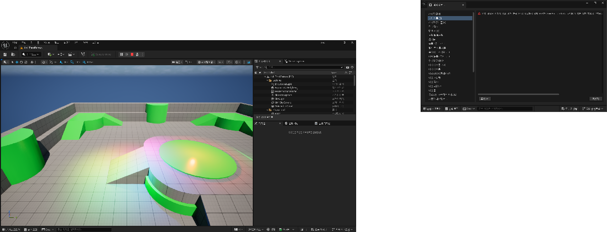
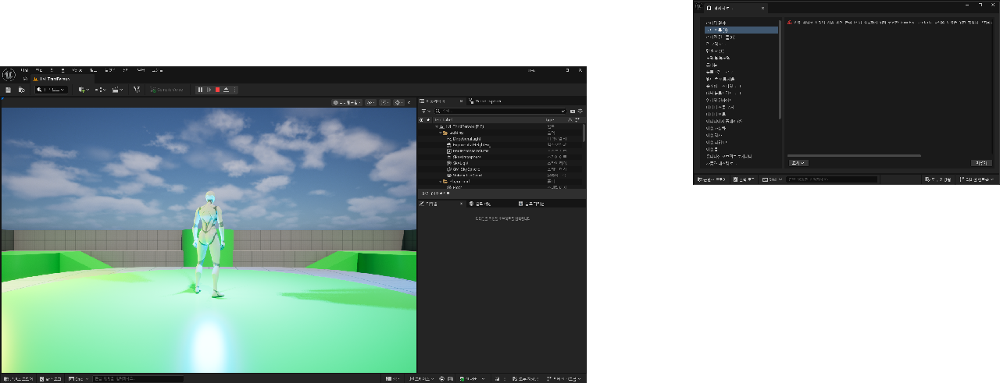
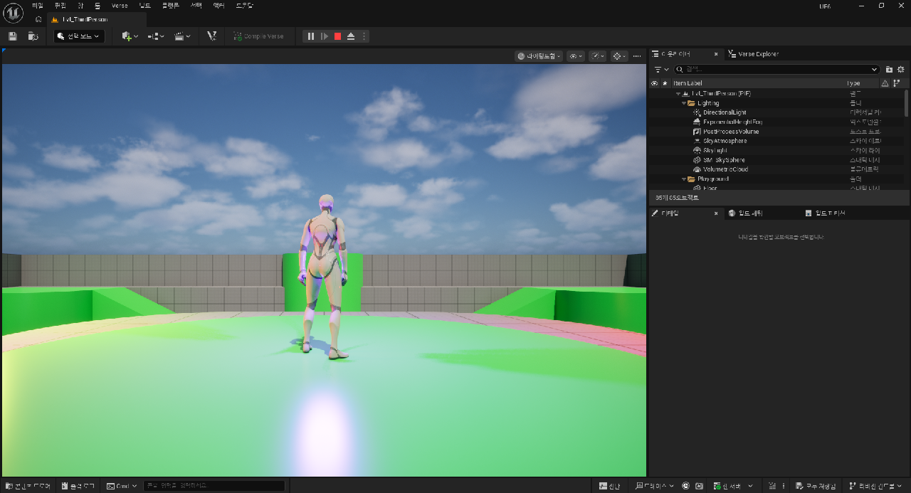

# UE6 Verse / Scene Graph 실습 기록

> 2026-08-23 · UE 6.0.0 소스 빌드(`D:\UnrealEngine`, 브랜치 `ue6-main`) · 스톡 서드퍼슨 템플릿에서 시작

목표: **UE6에서 Verse가 뭔지 파악하고, 켜고, 실제로 레벨에서 돌려보기.**

결론부터: 됩니다. 다만 문서에 안 나오는 벽이 여섯 개 있었고, 그 대부분은
"엔진 소스를 직접 읽어야만 알 수 있는" 것들이었습니다. 이 문서는 그 과정 기록입니다.

---


*메뉴에 `Verse`, 툴바에 `Compile Verse`, 우측에 `Verse Explorer` 탭이 생겼다.*

## 0. 출발점

프로젝트는 Epic의 Third Person 템플릿 원본이었습니다. C++ 42개 클래스, 749개 에셋,
Verse는 흔적도 없음. 엔진만 UE 6.0 소스 빌드.

```
Source/UE6/          6,637 LOC (Epic 원본 그대로)
Content/             749 uasset, 레벨 4개
Verse 관련 플러그인   전부 비활성
```

---

## 1. Verse 코드는 어디에 놓이는가

`UnrealBuildTool`을 읽어서 확인한 결과, Verse 코드를 스캔하는 위치는 **딱 두 곳**입니다.

| 위치 | 용도 | 요구사항 |
|---|---|---|
| `<플러그인>/Content/` | 스크립트 Verse | uplugin에 `CanContainVerse`, `VersePath` |
| `<모듈>/Verse/` | 네이티브 Verse (VNI) | Build.cs에 `SetupVerse(...)` |

근거: `ProjectFiles/VProject/VProjectFileGenerator.cs:179`가 플러그인의 `Content` 폴더를 잡고,
`Build/UEBuildModuleCPP.cs:212`가 `Build.cs` 옆의 `Verse` 폴더를 잡습니다.

### 벽 ① — uproject에는 Verse를 못 넣는다

`VersePath` / `VerseScope` / `CanContainVerse` 필드는 `PluginDescriptor.h`에만 있고
`ProjectDescriptor`에는 **없습니다.** 즉 프로젝트에 Verse를 쓰려면 플러그인을 하나 만들어야 합니다.

그래서 만든 것이 [`Plugins/VerseGame`](../Plugins/VerseGame/VerseGame.uplugin) —
C++ 모듈 없이 uplugin + `Content/*.verse`만 있는 플러그인입니다.

```json
{
	"VersePath": "/ue6.local/VerseGame",
	"VerseScope": "PublicUser",
	"CanContainVerse": true,
	"Plugins": [ { "Name": "EntityFramework", "Enabled": true } ]
}
```

### 벽 ② — `Print`가 안 딸려온다

Epic의 공식 컴포넌트 템플릿을 그대로 붙여넣어도 `Print`에서 심볼 해석이 실패합니다.
`Print`는 `VersePrint` 플러그인(`/Verse.org/Verse`)에 있는데, `EntityFramework`의
의존성 27개 체인에 **VersePrint가 없기 때문**입니다.

생성된 `.vproject`의 `dependencyPackages`를 뒤져서 알아냈습니다. uplugin에 직접 추가해야 합니다.

---

## 2. 첫 컴포넌트

[`HelloComponent.verse`](../Plugins/VerseGame/Content/HelloComponent.verse) /
[`SpinComponent.verse`](../Plugins/VerseGame/Content/SpinComponent.verse)

```verse
spin_component<public> := class<final_super>(component):

    @editable
    var DegreesPerSecond<public>:float = 90.0

    OnSimulate<override>()<suspends>:void =
        if (TransformComponent := Entity.GetComponent[transform_component]):
            var Yaw:float = 0.0
            loop:
                Sleep(UpdateInterval)
                set Yaw = Yaw + DegreesPerSecond * UpdateInterval
                ...
```

Actor + Tick 모델과 가장 다른 점이 `<suspends>`입니다. Tick 함수를 쓰지 않고
코루틴으로 돌며, 컴포넌트가 파괴되면 진행 중이던 suspension이 **자동 취소**됩니다.

---

## 3. 에디터 없이 Verse 컴파일 검증하기

에디터를 띄우지 않고 문법을 확인할 수 있습니다:

```bash
"D:/UnrealEngine/Engine/Binaries/Win64/VerseCompilerCmd.exe" "D:/Unreal Projects/UE6/Intermediate/ProjectFiles/Verse/All/All.vproject"
```

`.vproject`는 이렇게 생성/갱신합니다:

```bash
"D:/UnrealEngine/Engine/Build/BatchFiles/Build.bat" -projectfiles -project="D:/Unreal Projects/UE6/UE6.uproject" -game -engine -VProject
```

### 벽 ③ — 컴파일러가 실패해도 종료 코드는 0

일부러 깨진 파일을 넣어 확인했습니다:

```
VNI Compilation FAILED -- 1 error, 0 warnings!
__SyntaxProbe.verse(1,19, 1,19): Verse compiler error V3100: vErr:S77: Unexpected "verse" following expression
EXIT=0        ← 0 입니다
```

**출력 유무로 판단해야 합니다.** CI에 넣는다면 exit code가 아니라 stdout이 비었는지를 봐야 합니다.

---

## 4. 레벨에 붙이기 — 막힌 네 갈래

컴파일은 됐는데, 만든 컴포넌트를 레벨의 엔티티에 붙이는 데서 막혔습니다.
스크립트로 하려고 시도한 경로 전부 실패했습니다.

| 시도 | 결과 |
|---|---|
| Python `set_editor_property` | `Property 'Components' ... is protected and cannot be read` |
| MCP `ObjectTools.list_properties` (C++ 경유) | 빈 값 반환 |
| `SubobjectDataSubsystem` | 엔티티 프리팹에 대해 핸들 **0개** |
| Verse에서 엔티티 클래스에 컴포넌트 선언 | `V3600: Object archetype must initialize data member 'Entity'` |

네 번째가 특히 중요했습니다. 컴포넌트 필드를 선언하려면
`GetSelfEntityForComponentInitialization()`이 필요한데 `epic_internal`입니다.
`VerseScope`를 `InternalAPI`로 바꿔봤지만:

```
V3593: Invalid access of epic_internal function
       `(/Verse.org/SceneGraph:)GetSelfEntityForComponentInitialization`
       from control scope `/ue6.local/VerseGame/spinner_prefab_probe`
```

### 벽 ④ — epic_internal 게이팅은 스코프가 아니라 **도메인** 기준

`/ue6.local/...`은 Epic 도메인이 아니라서 `VerseScope`를 뭘로 바꿔도 열리지 않습니다.
(확인 후 원복했습니다.)

`EntityFramework` 전체에 `BlueprintCallable`이 **하나도 없습니다.** 엔진 주석도
"Primarily prefabs are authored through the editor"라고 못박고 있습니다.
GUI가 유일한 정식 경로 → 자동화하려면 C++ 밖에 없다는 결론.

---

## 5. C++ 유틸리티

[`Source/UE6/SceneGraph/SceneGraphTestUtils.h`](../Source/UE6/SceneGraph/SceneGraphTestUtils.h)

`UBlueprintFunctionLibrary` 하나로 필요한 것만 노출했습니다. `BlueprintCallable`이면
Python 바인딩이 자동으로 생기므로, 이후 모든 작업이 스크립트로 가능해집니다.

```cpp
SpawnEntityWithComponents(World, {ComponentClasses}, Transform, Name)
AddComponentToEntity(Entity, ComponentClass)
AddStaticMeshToEntity(Entity, Mesh)      // 에디터 전용
DestroyEntity(Entity)
GetEntityTransform(Entity)
GetAllEntities(World) / GetEntityComponents(Entity)
```

Build.cs에 `Entity`, `EntityLevel` 모듈을 추가하면 됩니다. 메시용 헬퍼는
에디터 모듈에만 있어서 `if (Target.bBuildEditor)`로 감쌌습니다.

### 벽 ⑦ — 씬 그래프에는 "메시 프로퍼티"가 없다

엔티티를 화면에 보이게 하려고 큐브를 붙이려다 막혔습니다. `mesh_component`에
`Mesh` 필드가 있긴 한데 `epic_internal`이고, 에디터가 쓰는 경로는 완전히 다릅니다:

```cpp
// 에디터의 "기본 도형 배치" 코드 (EntityPlacementFactory.cpp)
TSubclassOf<verse::component> MeshComponentClass =
    FAssetComponentHelpers::FindAssetComponentChildClassForAssetData(FAssetData(StaticMesh));
UE::SceneGraphAPI::GetOrCreateComponentByType(Entity, MeshComponentClass);
```

**메시 에셋마다 전용 컴포넌트 클래스가 따로 생성되어 있고**, 그 클래스를 붙이는 구조입니다.
`mesh_component`를 상속한 Verse 클래스가 에셋 하나당 하나씩 있고, 그 클래스의 CDO가
에셋 참조를 들고 있습니다.

이걸 만들어 보려고 다음을 시도했습니다:

1. 큐브를 `/VerseGame/Cube`로 복제 (플러그인 콘텐츠 안으로)
2. uplugin에 에셋 리플렉션 활성화
3. 에디터 재시작 + `Verse.RebuildAssetDigest` 콘솔 명령

### 벽 ⑧ — uplugin의 JSON 키 이름은 C++ 멤버 이름과 다르다

처음에 `"bEnableVerseAssetReflection": true`라고 썼는데 아무 일도 일어나지 않았습니다.
`PluginDescriptor.h`의 멤버 이름이 `bEnableVerseAssetReflection`이라 그대로 쓴 건데,
**JSON에서 읽는 키는 `b`가 빠진 이름**입니다:

```cpp
// Source/Runtime/Projects/Private/PluginDescriptor.cpp:354
TryGetBoolField(Object, TEXT("EnableVerseAssetReflection"), Result.bEnableVerseAssetReflection);
TryGetBoolField(Object, TEXT("EnableSceneGraph"),           Result.bEnableSceneGraph);
```

오타여도 **경고 한 줄 없이 무시**됩니다. 키를 고치니 `VerseGame/Assets` 패키지가
생성되고 `VerseGame-Assets.digest.verse`가 나오기 시작했습니다.

### 그래도 메시는 미해결

키를 고친 뒤에도 결과는 이랬습니다:

```
LogVerseUObjectGenerator: Generating UE types for Verse package VerseGame/Assets.
FCompiledPackageRegistry::SetGeneratedTypes(VerseGame/Assets, 0 types, 0 redirects)
```

디지스트 파일은 헤더만 있는 280바이트짜리 빈 파일이었습니다. 확인차 프로젝트와
엔진 콘텐츠 전체에서 Verse 클래스를 세어 보니:

```
/EntityFramework  VerseClass 0개
/Game             VerseClass 0개
/VerseGame        VerseClass 5개  (전부 우리가 작성한 컴포넌트/태스크)
```

**`mesh_component`를 상속한 클래스가 이 환경에 하나도 없습니다.** 즉 에디터의
"기본 도형을 엔티티로 배치" 기능도 이 프로젝트에서는 똑같이 실패할 겁니다.
메시 리플렉션 코드(`VerseMeshReflection.cpp`)의 게이팅 플래그
`bEnableVerseParameterizedMeshReflection` / `bInspectMeshesForVersePartReflection`은
둘 다 기본값이 `true`라 원인이 아니고, 그 아래에서 메시의
`MeshPartAssetUserData`를 요구하는 부분이 있습니다. 일반적인 임포트/복제 메시에는
그 유저 데이터가 없습니다.

여기서 멈췄습니다. 스톡 콘텐츠만으로는 메시 컴포넌트 클래스를 만들 수 없고,
Fortnite 쪽 콘텐츠 파이프라인을 거친 에셋이 필요해 보입니다.
`AddStaticMeshToEntity`는 코드로는 올바르니, 나중에 조건이 갖춰지면 그대로 동작합니다.

그래서 이번 검증은 화면이 아니라 **트랜스폼 수치**로 했습니다.

---

## 6. 두 번째 벽: 붙였는데 저장이 안 된다

첫 구현은 `entity->GetOrCreateComponentByType()`을 썼습니다. 결과:

- 편집 중인 월드에서는 컴포넌트 3개가 **잘 보임**
- 레벨 저장 후 리로드하면 `transform_component`만 남고 **Verse 컴포넌트는 사라짐**
- PIE로 들어가도 마찬가지

`Modify()`를 불러도 소용없었습니다. 로그에 경고 한 줄 없이 조용히 빠집니다.

### 벽 ⑤ — 이름이 같은 함수가 두 개 있다

에디터가 실제로 쓰는 코드를 grep해서 찾았습니다:

```cpp
// entity 의 멤버 함수 — 붙이기만 한다
Entity->GetOrCreateComponentByType(Type);

// UE::SceneGraphAPI 네임스페이스 — "handles all the changed events
// needed for the engine to recognize this change"
UE::SceneGraphAPI::GetOrCreateComponentByType(Entity, Type);
```

두 번째로 바꾸니 바로 해결됐습니다. `transform_component`가 살아남았던 이유도
`CreateEntity` 내부가 이미 `SceneGraphAPI` 쪽을 쓰고 있어서였습니다.

---

## 7. 자동화: 에디터를 MCP로 조작하기

UE6 에디터는 `ModelContextProtocol` 플러그인으로 `http://127.0.0.1:8000/mcp`에
MCP 서버를 띄웁니다(툴셋 72개). Claude Code 설정을 건드리지 않고 curl로 직접 붙였습니다.

```bash
# 1) initialize → 응답 헤더의 Mcp-Session-Id 확보
# 2) 이후 모든 요청에 Mcp-Session-Id 헤더
# 3) 실제 툴은 call_tool 로 감싸서 호출
```

함정 셋:
- 노출된 툴은 `list_toolsets` / `describe_toolset` / `call_tool` **3개뿐**. 실제 툴을 이름으로 직접 부르면 `Unknown tool`
- `describe_toolset`의 파라미터명은 `toolset`이 아니라 **`toolset_name`**
- `execute_python`의 `script`는 문자열이 아니라 **`{"content": ..., "language": "Python"}`** CodeBlock 객체

### 벽 ⑥ — 에디터가 백그라운드면 MCP가 응답하지 않는다

TCP 연결은 받아들이는데 응답이 없어서 한참 헤맸습니다. UE 에디터는 포그라운드가
아니면 게임스레드 틱을 스로틀링하고, MCP HTTP 핸들러가 게임스레드에서 돌기 때문입니다.
창을 포그라운드로 올리면 즉시 응답합니다.

---

## 8. 검증

`bSimulate: true`로 PIE를 띄우고 `GetEntityTransform`으로 0.5초 간격 샘플링:

```
대상: SpinnerEntity | 컴포넌트: ['transform_component', 'spin_component', 'hello_component']

1회차  0.5초 간격 Yaw: [162.0, -157.5, -117.0, -76.5, -36.0, 4.5]    → 구간당 +40.5°  (81°/초)
2회차  0.5초 간격 Yaw: [175.5, -144.0,  -99.0, -54.0,  -9.0, 36.0]   → 구간당 +45.0°  (90°/초)
```

(180도에서 부호가 뒤집히는 것을 감안한 값입니다.)


*`bSimulate: true`로 실행한 PIE. 아웃라이너가 `Lvl_ThirdPerson (PIE)`로 바뀐다.*

설정값은 `DegreesPerSecond = 90`, `UpdateInterval = 0.05`이므로 이론상 90°/초입니다.
2회차는 정확히 맞았고, 1회차는 81°/초로 10% 느렸습니다.

이 차이가 오히려 중요한 관찰이었습니다. `Sleep(0.05)`는 프레임 경계로 반올림되므로,
에디터가 바쁠 때는 0.5초에 10회가 아니라 9회만 돌아 그만큼 느려집니다.
**고정 스텝 × 고정 각도 방식은 프레임레이트에 종속됩니다.** 프레임과 무관한 회전이
필요하면 경과 시간을 직접 재서 곱해야 합니다.

---

## 9. 후일담 — 라이트로 시각화 문제 풀기

메시가 막혀서 "화면으로 확인할 방법이 없다"고 정리했었는데, 다시 보니 틀린
결론이었습니다. **라이트 컴포넌트는 그냥 됩니다.**

메시가 안 됐던 이유는 에셋마다 생성되는 전용 컴포넌트 클래스가 필요해서인데,
라이트는 에셋 참조가 없으니 그런 게 필요 없습니다. 클래스가 이미
`/EntityFramework/_Verse/VNI/Component`에 들어 있습니다.

### 먼저 뭐가 열려 있는지 컴파일러에 물어보기

추측하지 않고, 컴포넌트 타입을 파라미터로 받는 더미 함수를 잔뜩 만들어
한 번에 컴파일했습니다. 컴파일러가 접근 위반을 전부 모아서 알려줍니다.

```verse
probe_light(X:light_component):void = {}
probe_sound(X:sound_component):void = {}
probe_physics(X:physics_component):void = {}
...
```

| 쓸 수 있음 | 막힘 |
|---|---|
| `sphere_light` / `spot_light` / `directional_light` / `rect_light` / `capsule_light` | `physics_component` (epic_internal) |
| `sound_component`, `particle_system_component` | `decal_component`, `text_display_component` |
| `possessable_component`, `collision_volume` | `presentation_component`, `replication_component` |
| `mesh_component` (타입만) | `possessor_component` (internal) |

언어 기능 — `race` / `sync` / `branch` / `loop` / `Sleep`, `NamedColors`, `tag` — 은 전부 통과했습니다.

### 만든 것

[`LightPulseComponent.verse`](../Plugins/VerseGame/Content/LightPulseComponent.verse) —
같은 엔티티의 `sphere_light_component`를 찾아 밝기를 사인파로 맥동시키고
색상환을 순환시킵니다.

```verse
Wave := (Sin(Elapsed / PulsePeriod * 2.0 * PiFloat) + 1.0) / 2.0
set Light.Intensity = MinIntensity + (MaxIntensity - MinIntensity) * Wave

set Hue = Hue + 360.0 * UpdateInterval / ColorCyclePeriod
if (Hue > 360.0):
    set Hue = Hue - 360.0
set Light.ColorFilter = MakeColorFromHSV(Hue, 0.85, 1.0)
```

`sphere_light_component`의 `Intensity` / `AttenuationRadius` / `SourceRadius`와
`light_component`의 `ColorFilter` / `CastShadows` / `SpecularScale` / `DiffuseScale`가
`<public>`이라 그대로 쓸 수 있습니다.

| | |
|---|---|
|  |  |

같은 카메라에서 1.5초 간격으로 찍은 두 프레임입니다.

### 벽 ⑨ — 캡처가 계속 똑같이 나온다

시간에 따라 변하는 걸 스크린샷으로 남기려는데 세 장이 **바이트 단위로 동일**했습니다.
에디터 뷰포트가 그 사이에 다시 렌더되지 않기 때문입니다. MCP 호출이 게임스레드를
한 번 틱시키긴 하지만 캡처가 같은 틱에서 일어납니다.

해결은 캡처 사이에 에디터를 실제로 돌려주는 것이었습니다:

```python
for i in range(30):
    await asyncio.sleep(0.05)          # 에디터가 틱하도록 양보
unreal.EditorLevelLibrary.editor_invalidate_viewports()
```

### 참고 — Verse 프로퍼티는 파이썬에서 못 읽는다

`Intensity` 값을 수치로 확인하려 했지만 `get_editor_property`로는 안 됩니다:

```
Failed to find property '_Intensity' for attribute '_Intensity' on 'sphere_light_component'
```

Verse가 생성한 프로퍼티는 파이썬 리플렉션에 노출되지 않습니다. 수치가 필요하면
C++ 래퍼를 하나 더 만들어야 하고, 그렇지 않으면 화면으로 확인해야 합니다.

### 새 파일을 추가하면 에디터 재시작이 필요하다

`.verse` 파일을 새로 만들면 실행 중인 에디터가 자동으로 잡지 않습니다.
`Verse.Build` 콘솔 명령은 존재하지 않는 명령이라 무시되고(콘솔은 모르는 명령도
그냥 echo합니다), `Build Verse Code` 단축키(Ctrl+Shift+B)를 SendKeys로 보내도
반응이 없었습니다. 결국 재시작해야 잡힙니다.

> **정정:** 처음에 "기존 파일 수정은 자동으로 잡힌다"고 적었는데 확인해 보니
> 틀렸습니다. 기존 파일의 한 줄을 고치고 로그를 대조했더니 마지막
> `Global Verse compile` 시각이 파일 수정 시각보다 **앞**이었습니다.
> 신규 파일이든 기존 파일 수정이든 **에디터 밖에서 편집했다면 재시작이 필요합니다.**
> (에디터 내장 Verse 에디터로 편집하는 경우는 별도로 확인하지 않았습니다.)

---

## 10. 동시성 — Verse가 실제로 다른 지점

`race` / `sync` / `branch`는 Actor+Tick 모델에 없는 개념입니다.
[`ConcurrencyDemoComponent.verse`](../Plugins/VerseGame/Content/ConcurrencyDemoComponent.verse)로
셋을 라이트 색으로 구분해 돌려봤습니다.

### 검증을 어떻게 설계했나

동시성에서 확인해야 할 건 "무엇이 실행됐는가"가 아니라 **"무엇이 실행되지 않았는가"** 입니다.
`race`에서 진 쪽은 자동 취소되어야 하는데, 취소는 눈에 보이지 않습니다.

그래서 패자 안에 **절대 일어나면 안 되는 일**을 심었습니다:

```verse
ShouldBeCancelled(Light:sphere_light_component)<suspends>:void =
    Sleep(4.0)
    Print("!!! 취소 실패 - 이 줄이 보이면 버그 !!!")
    set Light.ColorFilter = NamedColors.White
    set Light.Intensity = 500.0        # 화면이 하얗게 타버린다

race:
    Step("1.5초 쪽(승자)", 1.5)
    ShouldBeCancelled(Light)
```

`Intensity = 500`은 **영구적**입니다. 한 번이라도 실행되면 이후 모든 프레임이 하얗게
날아갑니다. 즉 나중 프레임이 멀쩡하면 취소가 동작했다는 뜻입니다.

### 결과

2.5초 간격으로 8프레임(약 20초, 세 사이클)을 찍었습니다.

| SYNC 단계 (파랑) | RACE 단계 (빨강) |
|---|---|
|  |  |

세 번째 프레임이 빨강(정상), 마지막 프레임도 정상 밝기였습니다.
**취소가 실패했다면 첫 사이클에서 이미 하얗게 타버려 이후 프레임이 전부 오염됐을 겁니다.**

- `sync` — 2초 페이드와 3초 대기를 동시에 시작하고 **둘 다** 끝날 때까지 대기 → 3초
- `race` — 1.5초 쪽이 이기고 4초 쪽은 취소됨
- `branch` — 깜빡임을 배경으로 던지고 본류는 기다리지 않고 진행

### 벽 ⑩ — `branch`는 루프 안에서 못 쓴다

세 단계를 하나의 `loop` 안에 넣었더니:

```
V3552: 'branch' is not currently supported in loops.
```

`branch`만 루프 밖으로 빼서 진입 전에 한 번 실행하는 구조로 바꿨습니다.
`sync`와 `race`는 루프 안에서 문제없습니다.

### 참고 — Print는 로그에 안 남는다

`Print`는 `LogToScreen`으로 들어갑니다(`DiagnosticsLog.cpp`). 로그 파일에는
한 줄도 남지 않고, 화면 디버그 메시지로만 나옵니다. 시뮬레이트 모드 뷰포트
캡처에도 잡히지 않아서, 결국 **검증은 텍스트가 아니라 라이트 색으로** 했습니다.
자동화된 검증에 Print를 쓸 생각이라면 이 점을 먼저 알아야 합니다.

---

## 11. 엔티티 계층 절차적 생성

프리팹은 에디터에서만 저작할 수 있었지만(벽 ④), **런타임에 엔티티를 만들고
컴포넌트를 붙이는 것은 순수 Verse로 전부 가능합니다.** 컴파일 프로브로 먼저 확인했습니다:

```verse
Child := entity{}                                    # 생성 OK
Tc := transform_component{ Entity := Child }         # 컴포넌트 구성 OK
Child.AddComponents(array{ Tc, Light })              # 부착 OK
Entity.AddEntities(array{ Child })                   # 계층 편입 OK
```

아카타입(클래스 필드)에서 막혔던 건 `GetSelfEntityForComponentInitialization`이
`epic_internal`이라서였고, 런타임에는 `Entity := Child`로 직접 넘기면 됩니다.

[`OrbitSystemComponent.verse`](../Plugins/VerseGame/Content/OrbitSystemComponent.verse) —
시작할 때 위성 엔티티 N개를 만들어 자식으로 붙이고, 색상환을 나눠 가진 라이트를
각각 달아 궤도를 돌립니다.

### 벽 ⑪ — `no_rollback` 함수는 실패 컨텍스트에서 못 부른다

`AddComponents` / `AddEntities`는 `no_rollback` 이펙트입니다. 되돌릴 수 없는
연산이라 트랜잭션 안에서 부를 수 없습니다.

```
V3512: This invocation calls a function that has the 'no_rollback' effect,
       which is not allowed by its context.
```

두 군데서 걸렸습니다:

1. 헬퍼 함수를 `<transacts>`로 선언한 것 → 이펙트 지정을 아예 빼면 된다
   (`<no_rollback>`이라는 지정자는 **없습니다**. `V3506: Unknown identifier`)
2. `if (Tc := MakeSatellite(I)?)` → **`if`의 실패 컨텍스트가 롤백을 요구**하므로
   그 안에서 no_rollback 함수를 부를 수 없다. 옵셔널 반환을 없애서 해결

두 번째가 특히 헷갈렸습니다. 실패 컨텍스트는 문법적으로는 그냥 `if`처럼 보이지만
트랜잭션 경계를 만듭니다.

### 검증

위성 좌표를 읽어 부모 기준으로 반지름과 각도를 계산했습니다.

```
부모: (0.0, -700.0)

위성          반지름    각도(전)   각도(후)     변화
entity_0      250.0      168.8      92.3     -76.5
entity_1      250.0       96.8      20.3     -76.5
entity_2      250.0       24.8     308.3     -76.5
entity_3      250.0      312.8     236.3     -76.5
entity_4      250.0      240.8     164.3     -76.5
```

- 반지름 **250.0 정확히 일치** (설정값 `OrbitRadius = 250.0`)
- 각도 간격 **72.0° 균등** (360 / 5)
- 2초 동안 5개 모두 **동일하게 -76.5°** 이동



각속도는 38.3°/초로 나왔습니다. 설정값(`OrbitPeriod = 8.0` → 45°/초)의 85%인데,
`spin_component`에서 봤던 것과 **같은 원인**입니다 — `Sleep`이 프레임 경계로
반올림되기 때문입니다. 고정 스텝 방식은 프레임레이트에 종속된다는 게 여기서도
그대로 재현됐습니다.

### 부모-자식 트랜스폼

위성은 `LocalTransform`만 설정합니다. 부모(`OrbitSystem` 엔티티)를 움직이면
위성 5개가 통째로 따라옵니다 — 씬 그래프 계층이 실제로 동작한다는 뜻입니다.

---

## 12. 플레이어와 엮기 — 여기서 막혔다

`possessable_component`가 접근 가능 목록에 있길래 플레이어와 Verse 엔티티를
연결해 보려 했습니다. **결론부터: 이 빌드에서 사용자 코드로는 불가능합니다.**
왜 그런지 정리해 둡니다.

### 벽 ⑫ — 이름은 public인데 클래스가 epic_internal

접근 가능 프로브에서 `possessable_component`가 통과했던 건 **타입 이름**이
`<public>`이기 때문이었습니다. 정의를 보면:

```verse
possessable_component<native><public> := class<final_super><epic_internal>(component):
                       ^^^^^^^^                          ^^^^^^^^^^^^^^^
                       이름은 공개                        클래스는 내부용
```

그래서 타입으로 **참조는 되지만 생성이 안 됩니다**:

```
V3593: Invalid access of epic_internal class constructor `possessable_component`
```

프로브를 짤 때 타입 참조만 확인하고 "쓸 수 있다"고 분류한 게 성급했습니다.
**생성까지 시도해 봐야** 진짜 쓸 수 있는지 알 수 있습니다.

### 무엇이 되고 무엇이 안 되는가

| 동작 | 결과 |
|---|---|
| `possessable_component`를 타입으로 참조 | 가능 |
| `Entity.GetComponent[possessable_component]` | 가능 |
| `PossessableComp.Agent?` 로 빙의 주체 읽기 | 가능 |
| `agent.GetComponent[transform_component]` | 가능 |
| Verse에서 `possessable_component` **생성** | **불가** (생성자 epic_internal) |
| C++에서 `possessable_component` 부착 | **가능** (C++은 Verse 스코프 제약을 안 받음) |
| `possessor_component` 사용 | **불가** (클래스 전체가 `<internal>`) |
| `BeginPossess` / `EndPossess` 호출 | **불가** (전부 internal) |

즉 **빙의 상태를 읽을 수는 있지만 빙의를 일으킬 수는 없습니다.**

### 더 근본적인 문제 — 플레이어가 씬 그래프에 없다

읽기라도 하려면 플레이어를 찾아야 하는데, 그것도 막혔습니다.

플레이 모드(`bSimulate: false`)로 PIE를 띄우고 레벨 엔티티 트리를 전부 훑어봤습니다:

```
PIE 엔티티 9개 — 전부 우리가 만든 것
LevelEntity / SpinnerEntity / ConcurrencyDemo / OrbitSystem / entity_0..4
```

플레이어 폰은 없습니다. 에이전트 엔티티는 따로 존재하지만:

```
Simulation_player  BP_ThirdPersonPlayerController_C_0   컴포넌트 0개, 트랜스폼 없음
```

**플레이어 컨트롤러의 신원 토큰일 뿐 공간 정보가 없습니다.** 폰은 평범한 Actor고
씬 그래프에 아무 존재감이 없습니다. `entity`의 공개 API는 `GetParent` /
`GetEntities` / `GetComponent(s)` / `AddEntities` / `AddComponents` / `SendUp` /
`SendDown` 뿐이라, 트리 밖에 있는 것은 Verse에서 도달할 방법이 없습니다.

### 브릿지를 시도했지만

`ActorEntityComponent`를 플레이어 폰에 붙여 봤습니다. 파이썬으로 객체 생성까지는
되는데 `RegisterComponent`가 노출되지 않아 활성화되지 않았습니다. 코드를 읽어 보니
그것만으로는 부족합니다:

```cpp
// ActorEntityComponent.cpp:292
Entity = PrefabComponent->CreateEntity(Outer, Name);
```

`UActorEntityPrefabComponent`(+ 그 `EntityClass` 프리팹)가 먼저 있어야 엔티티가
생기는 구조입니다. 프리팹은 에디터에서 저작해야 하고(벽 ④), 결국 여러 단계가
엮여 있습니다.

### 남은 선택지

플레이어를 엮으려면 C++로 내려가야 합니다:

1. 폰에 `UActorEntityPrefabComponent` + `UActorEntityComponent`를 붙이고 등록하는
   C++ 함수를 만든다 (`RegisterComponent`는 C++에서 호출 가능)
2. `EntityClass`로 쓸 빈 프리팹을 준비한다
3. 브릿지된 엔티티가 `transform_component`를 갖는지 확인한다
   (`ActorEntityComponent.cpp:446`에 interop 규칙에 따라 생성하는 코드가 있다)

여기까지 되면 플레이어가 씬 그래프에 들어오고, Verse에서 트리 순회로 찾아
거리 기반 반응 같은 걸 만들 수 있습니다. 다만 **빙의 자체는 여전히 불가능**합니다 —
`possessor_component`가 통째로 내부용이라 우회로가 없습니다.

---

## 13. C++ 브릿지 — 플레이어를 씬 그래프로 끌어오기

12장에서 막혔던 걸 C++로 뚫었습니다. **플레이어 폰이 씬 그래프 엔티티를 갖게
됐고, Verse 컴포넌트가 그 위에서 돕니다.**

### 벽 ⑬ — 인터롭 서브시스템에 구체 클래스가 없다

`UActorEntitySubsystem`은 액터↔엔티티 브릿지를 관리하는 월드 서브시스템인데:

```cpp
UCLASS(Abstract, MinimalAPI)
class UActorEntitySubsystem : public UWorldSubsystem
```

**Abstract 이고, 엔진 전체에 구체 서브클래스가 하나도 없습니다.** 확인해 보니
파생 클래스가 자기 자신뿐이었습니다. Abstract 서브시스템은 인스턴스화되지 않으므로
`UActorEntitySubsystem::Get()`이 항상 null이고, **인터롭 레이어 전체가 죽어 있습니다.**

그리고 이름에 속기 쉬운 함수가 하나 더 있습니다:

```cpp
verse::entity* UActorEntitySubsystem::FindEntityForActor(AActor* Actor, const bool bAllowCreateEntity)
{
    const UActorEntityComponent* InteropComponent = Actor ? Actor->GetComponentByClass<UActorEntityComponent>() : nullptr;
    return InteropComponent ? InteropComponent->GetRootEntity() : nullptr;
}
```

`bAllowCreateEntity`를 **아예 쓰지 않습니다.** 이름과 달리 아무것도 만들지 않고
기존 컴포넌트를 조회만 합니다.

### 필요한 조건 세 가지

`UActorEntityComponent::OnComponentCreated()`가 초기화를 하는데, 게이트가 이렇습니다:

```cpp
if (!World || !OwnerActor || !InteropSubsystem || !InteropRules
    || InteropRules->ActorEntityConsidered == EConsideredForActorEntityInterop::No || !HasValidRole)
{
    return;   // 조용히 건너뛴다
}
```

1. 구체 서브시스템 인스턴스
2. 해당 액터 클래스에 매칭되는 인터롭 규칙 (`IsChildOf` 매칭)
3. 액터에 `UActorEntityComponent` (생성 시점에 초기화되므로 `AddComponentByClass` 사용)

### 구현

[`UE6ActorEntitySubsystem.h`](../Source/UE6/SceneGraph/UE6ActorEntitySubsystem.h) —
빠져 있던 구체 클래스를 만들고 규칙을 제공합니다.

```cpp
FActorEntityInteropRules& Rule = CachedRules.AddDefaulted_GetRef();
Rule.ActorClass = ACharacter::StaticClass();       // IsChildOf 라 BP_ThirdPersonCharacter 도 잡힌다
Rule.ActorEntityConsidered = EConsideredForActorEntityInterop::Yes;
Rule.AllowedEntityComponents.Add(verse::transform_component::StaticClass());
```

`SceneGraphTestUtils::BridgeActorToSceneGraph(Actor)`가 컴포넌트를 붙입니다.

### 결과

```
브릿지 엔티티: ...SimulationEntity.BP_ThirdPersonCharacter0_0
  컴포넌트: ['replication_component', 'transform_component',
             'tag_component', 'possessable_component']
```

`possessable_component`가 **자동으로** 붙었습니다. 인터롭이 켜지면 빙의 관련 배관도
같이 붙는다는 뜻입니다.

폰을 옮기며 엔티티 트랜스폼을 대조했습니다:

```
                  폰 위치                      엔티티 트랜스폼
(    0.0,    0.0, 302.0)  ->  (    0.0,    0.0, 302.0)
(  400.0,    0.0, 292.4)  ->  (  400.0,    0.0, 292.4)
(  400.0,  400.0, 292.2)  ->  (  400.0,  400.0, 292.2)
(    0.0,  400.0, 292.4)  ->  (    0.0,  400.0, 292.4)
```

Z의 소수점 변화까지 그대로 따라옵니다. 여기에 `sphere_light_component`와
우리가 만든 `light_pulse_component`를 붙이면 **Verse가 제어하는 라이트가
플레이어를 따라다닙니다.**



### 남은 한계

- **빙의는 여전히 불가능합니다.** `possessable_component`가 붙긴 했지만
  `possessor_component`가 `<internal>`이라 `BeginPossess`를 부를 수단이 없습니다.
- 플레이어 엔티티는 `LevelEntity`가 아니라 **`SimulationEntity` 아래**에 생깁니다.
  레벨에 배치한 우리 엔티티들과 트리가 달라서, Verse 컴포넌트가 트리 순회로
  플레이어를 찾는 건 안 됩니다. 대신 **플레이어 엔티티에 컴포넌트를 직접 붙이는**
  방식으로 우회했습니다.
- `FindActorForEntity` 역방향 조회는 `None`을 돌려줬습니다. 매핑 등록 경로가
  따로 있는 듯한데 추적하지 않았습니다.
- ~~브릿지는 PIE 세션마다 런타임에 걸어야 합니다.~~ **해결됨** — 아래 참고.

### 영구화 — 폰 블루프린트에 컴포넌트 추가

`BP_ThirdPersonCharacter`에 `UActorEntityComponent`를 직접 넣으면 매번 스크립트를
돌릴 필요가 없습니다. 파이썬의 `SubobjectDataSubsystem`으로 붙였습니다:

```python
sds = unreal.get_engine_subsystem(unreal.SubobjectDataSubsystem)
handles = sds.k2_gather_subobject_data_for_blueprint(bp)
params = unreal.AddNewSubobjectParams(
    parent_handle=handles[0], new_class=unreal.ActorEntityComponent, blueprint_context=bp)
new_handle, fail = sds.add_new_subobject(params)
unreal.BlueprintEditorLibrary.compile_blueprint(bp)
```

> 참고: 앞서 엔티티 프리팹에 이 API를 썼을 땐 핸들이 0개였습니다(벽 ④).
> **일반 블루프린트에서는 정상 동작합니다** — 씬 그래프 프리팹만 별도 체계를 씁니다.

검증 — 스크립트 개입 없이 PIE만 켜고 조회했습니다:

```
폰: BP_ThirdPersonCharacter_C_0 (0.0, 0.0, 302.0)

스크립트 개입 없이 조회한 엔티티:
  ...SimulationEntity.BP_ThirdPersonCharacter_C_1
  컴포넌트: ['replication_component', 'transform_component',
             'tag_component', 'possessable_component']
  트랜스폼: (0.0, 0.0, 302.0)
```

이제 플레이어는 **PIE를 켜는 순간 자동으로** 씬 그래프에 들어옵니다.

### Verse 컴포넌트까지 영구화 — 프리팹 저작이 사실은 됐다

`UActorEntityPrefabComponent`에 물릴 프리팹이 필요한데, 프리팹 저작은 벽 ④에서
막혔던 것이었습니다. 그런데 다시 해보니 **C++ 경유로는 됩니다.**

프리팹의 생성 클래스 CDO는 그 자체가 `verse::entity`입니다. 거기에
`AddComponentToEntity`를 그대로 쓰면 됩니다:

```python
cdo = unreal.get_default_object(prefab.generated_class())
unreal.SceneGraphTestUtils.add_component_to_entity(cdo, sphere_light_component)
unreal.SceneGraphTestUtils.add_component_to_entity(cdo, light_pulse_component)
# -> ['transform_component', 'sphere_light_component', 'light_pulse_component']
```

저장 후에도 유지됩니다. 벽 ④에서 막혔던 건 **Verse 아카타입 선언**과
**SubobjectDataSubsystem 경로**였지, 프리팹 자체가 불가능한 게 아니었습니다.

### 벽 ⑭ — 컴포넌트 생성 순서가 결과를 바꾼다

프리팹을 물리고 PIE를 켰는데 라이트가 안 붙었습니다. 엔티티 클래스가
`Prefab_Spinner_C`가 아니라 그냥 `entity`였습니다. 원인은 코드에 있었습니다:

```cpp
// UActorEntityComponent::CreateInteropEntity
UActorEntityPrefabComponent* PrefabComponent = OwnerActor->GetComponentByClass<UActorEntityPrefabComponent>();
if (PrefabComponent) { Entity = PrefabComponent->CreateEntity(Outer, Name); }
else                 { Entity = NewObject<verse::entity>(...); }   // 조용한 폴백
```

`UActorEntityComponent`가 **먼저** 생성되면 그 시점에 프리팹 컴포넌트가 아직
없어서 폴백을 탑니다. 블루프린트 컴포넌트 순서를 확인해 보니:

```
... ActorEntityComponent, ActorEntityPrefabComponent, ...   <- 순서가 반대
```

`delete_subobject`로 `ActorEntityComponent`를 지웠다가 다시 추가해서
프리팹 컴포넌트 뒤로 보내니 해결됐습니다. 에러도 경고도 없이 그냥 다른 결과가
나오는 종류의 문제입니다.

### 최종 결과

PIE를 켜기만 하면 (스크립트 개입 없이):

```
엔티티: BP_ThirdPersonCharacter_C__3dn90ur2479l3_...   Class 'Prefab_Spinner_C'
컴포넌트: ['transform_component', 'sphere_light_component', 'light_pulse_component',
           'replication_component', 'tag_component', 'possessable_component']
트랜스폼: (0.0, 0.0, 302.0)
```



**보너스로 앞서 적었던 한계 하나가 해소됐습니다.** 프리팹 경로로 만들어진 엔티티는
`FCreateEntityParams(Level, ...)`를 쓰기 때문에 `SimulationEntity`가 아니라
**`LevelEntity` 트리 아래**에 생깁니다:

```
LevelEntity
├── SpinnerEntity / ConcurrencyDemo / OrbitSystem / entity_0..4
└── BP_ThirdPersonCharacter_C__...        (0.0, 0.0, 302.0)   <- 플레이어
```

즉 이제 **Verse 컴포넌트가 트리 순회로 플레이어를 찾을 수 있습니다.**
거리 기반 상호작용 같은 걸 만들 수 있는 상태가 됐습니다.

> 참고: 프리팹 이름이 `Prefab_Spinner`인데 지금은 플레이어용으로 쓰이고 있습니다.
> 초기 실험 때 만든 이름이 그대로 남은 것으로, 이름만 부적절합니다.

---

## 삽질 요약

| # | 벽 | 알아낸 방법 |
|---|---|---|
| ① | uproject에 Verse 필드가 없음 | `PluginDescriptor.h` vs `ProjectDescriptor.h` 비교 |
| ② | `Print`가 EntityFramework에 안 딸려옴 | 생성된 `.vproject`의 `dependencyPackages` 확인 |
| ③ | Verse 컴파일러가 실패해도 exit 0 | 일부러 깨뜨려서 확인 |
| ④ | epic_internal은 도메인 기준 게이팅 | `VerseScope` 바꿔보고 에러 메시지 확인 |
| ⑤ | 같은 이름의 함수 두 개 (멤버 vs SceneGraphAPI) | 에디터 자체 코드 grep |
| ⑥ | 백그라운드 에디터는 MCP 응답 없음 | 창 포그라운드로 올려보고 확인 |
| ⑦ | 메시는 에셋별 생성 컴포넌트 클래스로 붙임 | 에디터 배치 팩토리 코드 추적 |
| ⑧ | uplugin JSON 키에는 `b` 접두사가 없음 (조용히 무시됨) | `PluginDescriptor.cpp`의 `TryGetBoolField` 확인 |
| ⑨ | 연속 캡처가 바이트 단위로 동일 | 캡처 사이에 에디터를 틱시켜 해결 |
| ⑩ | `branch`는 루프 안에서 금지 (V3552) | 컴파일 에러로 확인, 루프 밖으로 이동 |
| ⑪ | `no_rollback` 함수는 `if` 실패 컨텍스트에서 호출 불가 (V3512) | 옵셔널 반환을 없애서 해결 |
| ⑫ | 이름은 `<public>`인데 클래스가 `<epic_internal>` — 참조만 되고 생성 불가 | 생성까지 프로브해서 확인 |
| ⑬ | 인터롭 서브시스템이 Abstract 인데 구체 클래스가 엔진에 없음 | 파생 클래스 스캔, 직접 구현 |
| ⑭ | BP 컴포넌트 생성 순서에 따라 조용히 다른 결과 | 런타임 컴포넌트 순서 확인 후 재정렬 |

## 다시 한다면

1. 플러그인부터 만든다 (uproject에 직접 못 넣음)
2. 쓸 Verse API가 어느 플러그인 소속인지 `.vproject`로 먼저 확인한다
3. 씬 그래프를 코드로 다룰 거면 처음부터 `UE::SceneGraphAPI` 네임스페이스만 쓴다
4. 에디터 자동화 전에 창을 포그라운드로 올린다
5. uplugin에 플래그를 넣었는데 아무 반응이 없으면 오타를 의심한다 — 검증도 경고도 없다
6. 뭐가 되는지 궁금하면 더미 함수로 컴파일 프로브를 돌린다. 문서보다 컴파일러가 정확하다
7. 시각 확인이 필요한데 메시가 막히면 라이트를 쓴다
8. 동시성은 "실행되면 안 되는 일"을 영구적으로 눈에 띄게 심어놓고 검증한다
9. 아카타입이 막혔다고 포기하지 말고 런타임 생성 경로를 확인한다 — 제약이 다르다
10. 접근 가능 프로브는 타입 참조가 아니라 **생성까지** 시도해야 의미가 있다
11. 파라미터 이름을 믿지 말고 구현을 읽는다 (`bAllowCreateEntity`는 쓰이지도 않는다)
12. "막혔다"는 결론은 경로별로 다시 검증한다 — 프리팹 저작은 Verse에서만 막혔고 C++로는 됐다
